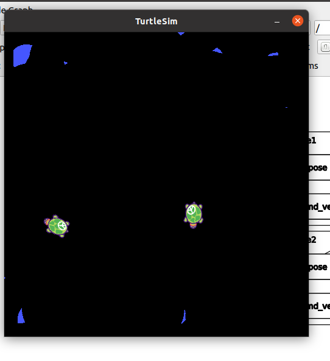
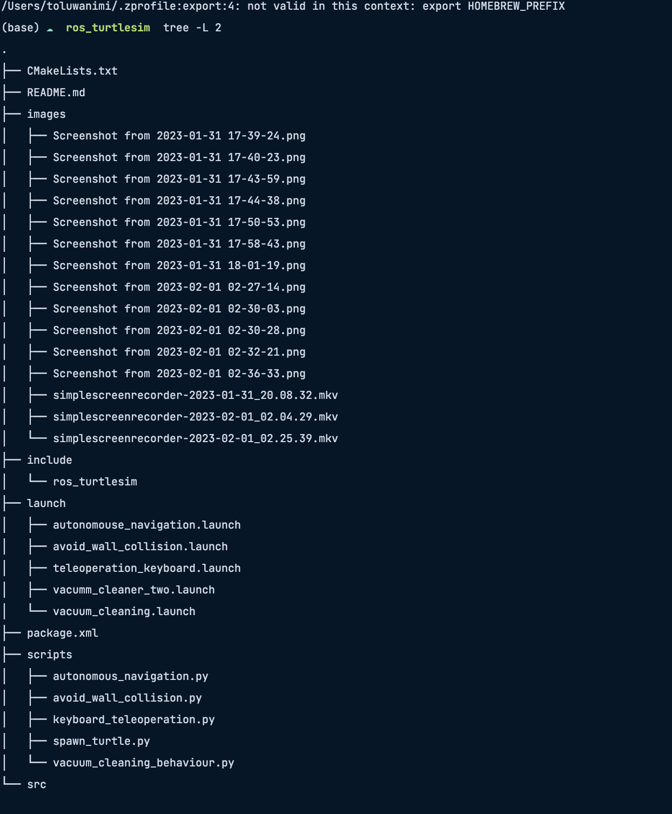
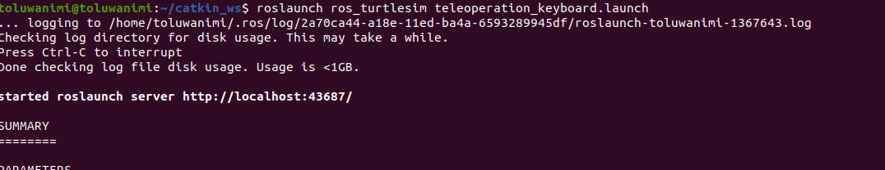
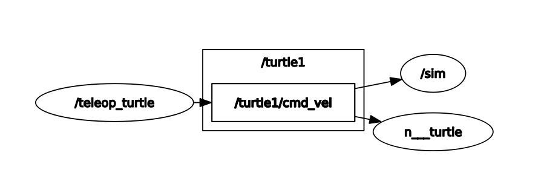
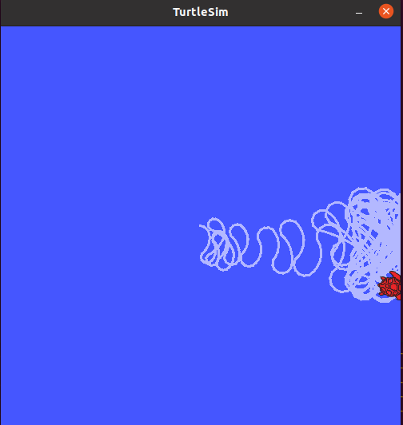
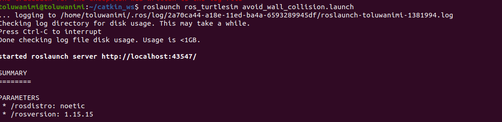
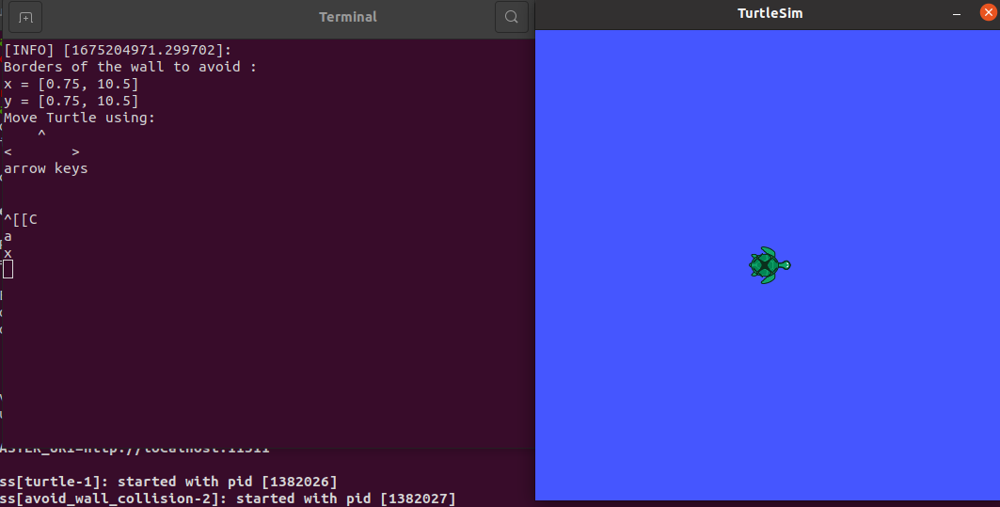
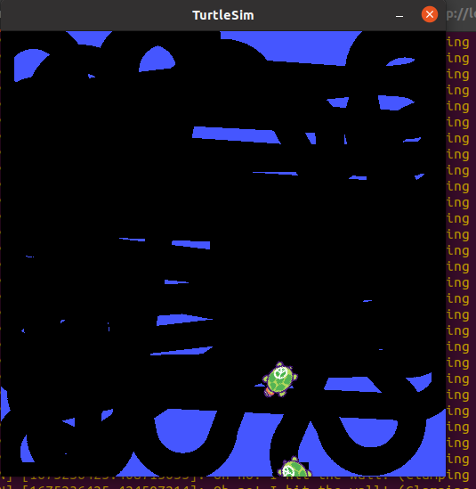
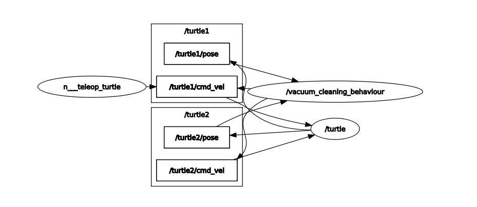

# Turtle Simulation


##### This coursework involves performing various tasks with the turtle simulation tool provided in ROS (Robot Operating System). The tasks include teleoperation using the keyboard, autonomous navigation to a given coordinate, wall collision avoidance, and vacuum cleaner behavior.


### Video Link : https://youtu.be/iCXz1CN7zhE

[](https://youtu.be/iCXz1CN7zhE)


## Requirements

1. ROS Noetic
2. Ubuntu 20.04

## Projects
Project folders in this repository are complete on their own and require no additional downloads.
Contents of each project should be placed in the ```src``` folder of the catkin workspace.



The launch files are located in the ```launch``` folder in the project

The python scripts carrying out the processes are located in the ```scripts``` folder.


Every `.py` and `.launch` files needs to be an executable file.

To do that, Open the `Terminal` Go to File location as shown in below image

- Type ```chmod +x filename.launch``` for execution of launch file and

- Type ```chmod +x filename.py``` for `.py` files


## Tasks
### Task 1: Teleoperating ROS Turtle using a keyboard

In this Task, we will see how to teleoperate a robot manually using a keyboard. Using a keyboard, we can translate and rotate the robot. One of the basic example to demonstrate keyboard teleoperation is ROS turtlesim.


- Type this command ```roslaunch ros_turtlesim teleoperation_keyboard.launch```


- Message is displayed in `terminal`

- RQT Graph : type ```rqt_graph```



```I made update to my code regarding teleoperation but I could not make a video recording, the update involves the use of right direction keyboard instructions```
#

### Task 2: Navigate the turtle from a random location to an input location


- Type this command ```roslaunch ros_turtlesim autonomouse_navigation.launch```


- Enter the Coordinates Range should be between `[0 - 11]` in both `x`and `y` direction

- Final `Output` of this Task




### Task 3: Avoiding Wall Collin

- Type the command ``` roslaunch ros_turtlesim avoid_wall_collision.launch ``` :


- Displaying this message in `Terminal`
```
Borders of the wal to avoid :
x = [0.75, 10.5]  
y = [0.75, 10.5]
```
- Final `output` of this Task:


  

### Task 4: Implementing Vaccum Cleaning Behaviour

- Type to Launch file ```roslaunch ros_turtlesim vacuum_cleaning.launch```


- Final Output of this Task




- RQT Graph : type ```rqt_graph```



 


